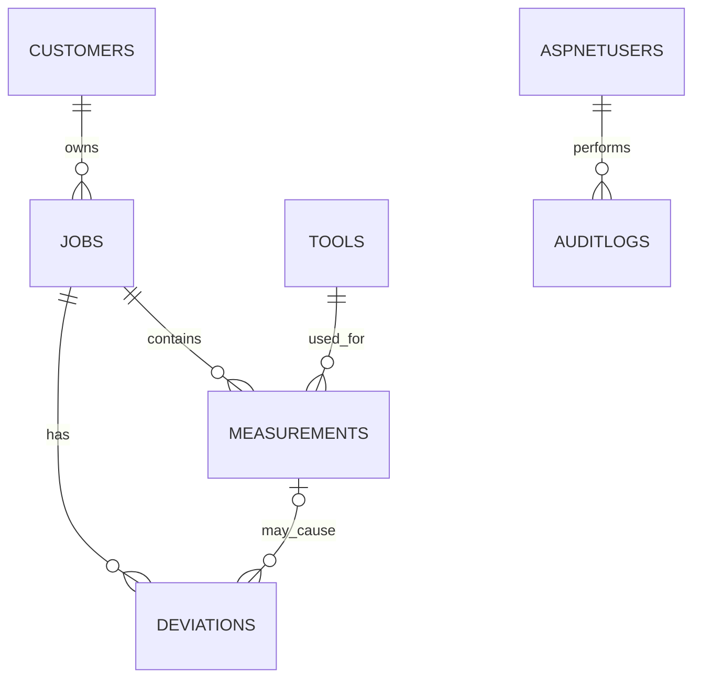

# CertiFlow Database Model (.NET MVP)

## 1. Purpose

This document describes the **minimum viable database model** for the CertiFlow .NET project.

The goal is to build a database-driven web application that fulfils the course requirements.
After the .NET project for the Web Development programme is completed, the system will be further developed as part of the course "Examensarbete" in Informatics with a specialization in Systems Development.
**The two projects are now clearly separated.**

### Design principles

- PostgreSQL + Entity Framework Core
- ASP.NET Core Identity
- UUID for application entities
- Identity user keys (`TEXT`)
- UTC timestamps
  TIMESTAMPTZ (Database) & DateTimeOffset (Application) - Store all timestamps in UTC - Display local time in the UI
- Simple domain model
- Easy to extend through future EF Core migrations

---

# 2. MVP Scope

## Included

- ASP.NET Core Identity
- Customers
- Jobs
- Measurements
- Tools
- Deviations
- AuditLog
- PDF Certificate generation (generated from Job + Measurements)

---

# 3. Entity Relationship Diagram

---

# 4. Entities

## Customer

Represents a customer owning one or more jobs.

| Field              | Type         | Notes    |
| ------------------ | ------------ | -------- |
| Id                 | UUID         | PK       |
| Name               | VARCHAR(150) | Required |
| OrganizationNumber | VARCHAR(50)  | Unique   |
| CreatedAtUtc       | TIMESTAMPTZ  | Audit    |
| CreatedByUserId    | TEXT         | FK       |
| UpdatedAtUtc       | TIMESTAMPTZ  | Audit    |
| UpdatedByUserId    | TEXT         | FK       |

---

## Job

Represents a quality assurance job.

| Field             | Type         | Notes                    |
| ----------------- | ------------ | ------------------------ |
| Id                | UUID         | PK                       |
| CustomerId        | UUID         | FK                       |
| JobNumber         | VARCHAR(50)  | Unique                   |
| Title             | VARCHAR(150) | Required                 |
| Description       | TEXT         | Optional                 |
| Status            | INT          | Enum                     |
| CertificateNumber | VARCHAR(100) | Generated after approval |
| ApprovedAtUtc     | TIMESTAMPTZ  | Nullable                 |
| ApprovedByUserId  | TEXT         | Nullable FK              |
| CreatedAtUtc      | TIMESTAMPTZ  | Audit                    |
| CreatedByUserId   | TEXT         | FK                       |
| UpdatedAtUtc      | TIMESTAMPTZ  | Audit                    |
| UpdatedByUserId   | TEXT         | FK                       |

---

## Measurement

Stores one measurement performed using a selected tool.

| Field             | Type          | Notes       |
| ----------------- | ------------- | ----------- |
| Id                | UUID          | PK          |
| JobId             | UUID          | FK          |
| ToolId            | UUID          | FK          |
| Value             | NUMERIC(18,4) | Required    |
| Unit              | VARCHAR(30)   | Required    |
| Notes             | TEXT          | Optional    |
| Status            | INT           | Enum        |
| MeasuredAtUtc     | TIMESTAMPTZ   | Required    |
| PerformedByUserId | TEXT          | FK          |
| VerifiedAtUtc     | TIMESTAMPTZ   | Nullable    |
| VerifiedByUserId  | TEXT          | Nullable FK |
| CreatedAtUtc      | TIMESTAMPTZ   | Audit       |
| CreatedByUserId   | TEXT          | FK          |
| UpdatedAtUtc      | TIMESTAMPTZ   | Audit       |
| UpdatedByUserId   | TEXT          | FK          |

---

## Tool

Represents a measuring instrument.

| Field                    | Type         | Notes        |
| ------------------------ | ------------ | ------------ |
| Id                       | UUID         | PK           |
| Name                     | VARCHAR(150) | Required     |
| SerialNumber             | VARCHAR(100) | UNIQUE       |
| ToolType                 | VARCHAR(100) | Required     |
| CalibrationStatus        | INT          | Enum         |
| CalibrationValidUntilUtc | TIMESTAMPTZ  | Nullable     |
| IsActive                 | BOOLEAN      | Default TRUE |
| CreatedByUserId          | TEXT         | FK           |
| CreatedAtUtc             | TIMESTAMPTZ  | Audit        |
| UpdatedAtUtc             | TIMESTAMPTZ  | Audit        |
| UpdatedByUserId          | TEXT         | Nullable FK  |

---

## Deviation

Represents a quality issue.

| Field            | Type        | Notes       |
| ---------------- | ----------- | ----------- |
| Id               | UUID        | PK          |
| JobId            | UUID        | FK          |
| MeasurementId    | UUID        | Nullable FK |
| Description      | TEXT        | Required    |
| Severity         | INT         | Enum        |
| Status           | INT         | Enum        |
| CreatedAtUtc     | TIMESTAMPTZ | Audit       |
| CreatedByUserId  | TEXT        | FK          |
| UpdatedAtUtc     | TIMESTAMPTZ | Audit       |
| UpdatedByUserId  | TEXT        | Nullable FK |
| ResolvedAtUtc    | TIMESTAMPTZ | Nullable    |
| ResolvedByUserId | TEXT        | Nullable FK |

---

## AuditLog

Stores critical business events.

| Field             | Type         | Notes    |
| ----------------- | ------------ | -------- |
| Id                | UUID         | PK       |
| EntityType        | VARCHAR(100) | Required |
| EntityId          | VARCHAR(100) | Required |
| Action            | INT          | Enum     |
| PerformedAtUtc    | TIMESTAMPTZ  | Required |
| PerformedByUserId | TEXT         | FK       |
| Description       | TEXT         | Optional |

---

# 5. Status Enums

## JobStatus

- Draft
- InProgress
- Verified
- Approved
- Archived

## MeasurementStatus

- Draft
- Verified
- Rejected

## DeviationStatus

- Open
- Resolved
- Closed

## AuditAction

- Create
- Update
- Submit
- Verify
- Approve
- Delete

## CalibrationStatus

- Valid
- Expired

## Severity

- Minor
- Major
- Critical

---

# 6. Business Rules

- JobNumber is globally unique.
- OrganizationNumber is globally unique.
- Tool's SerialNumber is globally unique.
- Every measurement belongs to one job.
- Every measurement must reference one tool.
- An operator cannot verify their own measurement.
- An approver cannot approve their own work.
- All timestamps are stored in UTC.
- Historical business data must not be cascade deleted.
- PDF certificates are automatically generated after a job has been approved.

---
